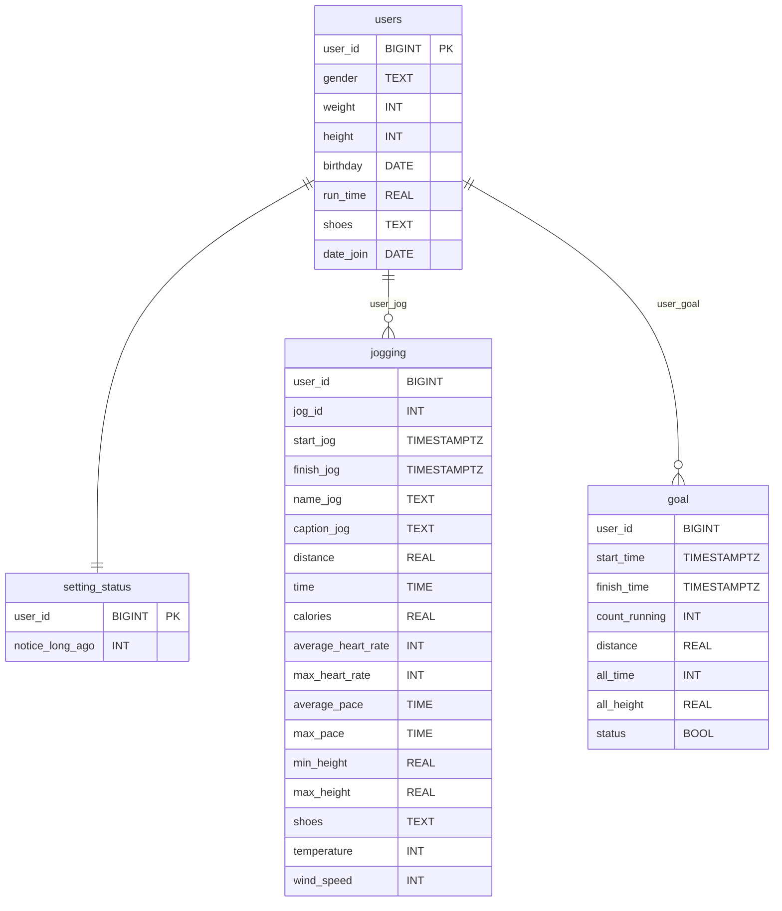

# 🏃 Running Stats Bot

[](https://vk.com/club235939336)
[](LICENSE)

---

## 📖 О проекте

Этот бот помогает собирать данные о пробежках и отслеживать статистику.

**Ссылка на сообщество с ботом:** https://vk.com/club235939336

Бот умеет:
- Вносить данные о пробежках вручную (через диалог с ботом)
- Импортировать данные из `.csv` файла (формат как в Zeopoxa Бег*)
- Отслеживать статистику по пробежкам
- Ставить цели и следить за их выполнением
- Соревноваться с мини-соперником (под капотом — ML модель, предсказывающая темп)
- И многое еще...

### 🎯 Цель проекта

Это **учебный проект**, подкреплённый энтузиазмом. Создан для узкого круга лиц, но если кого-то заинтересует — буду рад каждому

Во многом этот проект не несет практической пользы (так как есть достаточно много приложений, которые хорошо заменяют функционал этого бота, но все же для отслеживания статистики это неплохой вариант)


### 📚 Что я вынес из проекта

- Асинхронное программирование на Python
- Работу с `psycopg3` и базами данных (PostgreSQL)
- Интеграцию с VK API
- Простые ML модели для предсказаний

---

## 🧱 Структура проекта
```text
running_bot/
├── database/
│ ├── init.py
│ └── db.py
├── handlers/
│ ├── init.py
│ ├── main.py
│ ├── menu.py
│ ├── start.py
│ └── work_with_db.py
├── keyboards/
│ ├── init.py
│ └── all_keyboards.py
├── ml_models/
│ ├── init.py
│ └── models.py
├── .env
├── bot_run.py
├── create_bot.py
├── requirements.txt
└── README.md

model/
- covid_intelligence.ipynb #EDA данных пробежек многих пользователей
- jog_bot_ml.ipynb #Выбор и обучение модели
```
## Структура базы данных
## 🗄 ER-диаграмма (Mermaid)


---

## Технологии

- **Язык:** Python
- **Библиотеки:** vkbottle, psycopg3, asyncio, scikit-learn
- **База данных:** PostgreSQL
- **ML:** scikit-learn, xgboost

## ⚠️ Известные проблемы

- Импорт только из Zeopoxa Бег (нужны другие форматы)
- *Когда будет окончательно произведен отбор моделей, тогда также добавятся файлы с их обучением и EDA данных, на которых они обучались*


*Буду очень рад замечаниям/советам/новым идеям, и особенно если вы поможете найти другие форматы / приложения для бега, из которых можно импортировать данные. Пишите в Issues или в сообщество!*

⚠️ **Важно:** Бот захощен локалько, поэтому иногда может не работать в связи с отсутствием интернета или какими-то другими причинами
